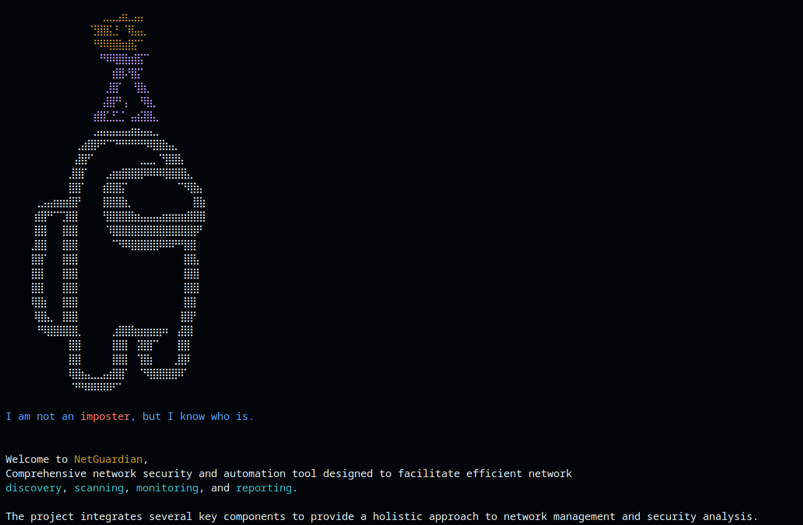
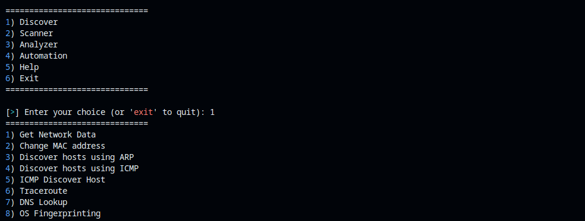
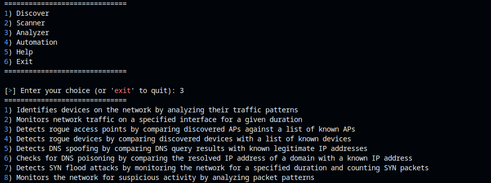
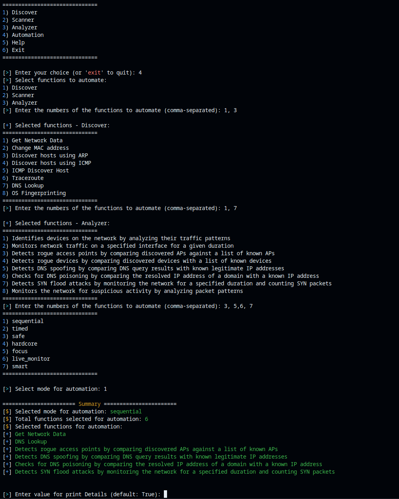

# **NetGuardian**

**NetGuardian** is a comprehensive network security and automation tool designed to facilitate efficient network discovery, scanning, monitoring, and reporting. The project integrates several key components to provide a holistic approach to network management and security analysis. Below are the main components and their functionalities:

---

### Components and Functionalities:

#### 1. **Discover**
The Discover module focuses on identifying and mapping network devices and their attributes. Its primary functions include:

- **Network Data Retrieval**: Gathers detailed network data such as IP addresses, network interfaces, and subnet information.
- **Host Discovery**: Utilizes ARP and ICMP protocols to identify active hosts on the network.
- **MAC Address Management**: Changes the MAC address of the network interface for anonymity or testing purposes.
- **Network Mapping**: Creates a visual representation of the network with discovered hosts.
- **Traceroute and DNS Lookup**: Provides path information to a destination and resolves domain names.
- **OS Fingerprinting**: Identifies the operating system running on a target IP.

#### 2. **Port_Scanner**
Built on the NetworkConfig class, the Port_Scanner module offers extensive network scanning capabilities. Key features include:

- **Targeted Scanning**: Scans specified IP addresses and ports to identify open ports and services.
- **Protocol and Service Detection**: Identifies running services and their versions on open ports.
- **SSL Certificate Retrieval**: Fetches SSL certificates to ensure secure communication.
- **Geolocation and MAC Address Resolution**: Determines the physical location of IP addresses and retrieves MAC addresses.
- **Extended Scanning Options**: Includes additional functionalities like OS detection and banner grabbing.

#### 3. **Analyzer**
The Analyzer module provides advanced network traffic analysis and anomaly detection. Its capabilities include:

- **Traffic Monitoring**: Captures and analyzes network traffic to identify devices based on traffic patterns.
- **Rogue Device Detection**: Identifies unauthorized devices and access points within the network.
- **DNS Analysis**: Performs DNS lookups and detects potential DNS spoofing or poisoning.
- **Suspicious Activity Detection**: Monitors the network for unusual activities, such as SYN flood attacks.

#### 4. **TaskAutomation**
The TaskAutomation module allows users to automate and manage multiple tasks efficiently. It supports various execution modes:

- **Sequential and Parallel Execution**: Runs tasks one after another or simultaneously.
- **Timed and Safe Modes**: Adds delays between tasks for better management.
- **Hardcore Mode**: Retries failed tasks up to three times.
- **Focus and Live Monitor Modes**: Provides real-time monitoring and detailed logs of task execution.
- **Smart Mode**: Includes random delays and MAC address changes for enhanced security.

#### 5. **Report_Generator**
The Report_Generator module produces detailed reports in multiple formats. It includes:

- **CSV, TXT, and JSON Report Generation**: Converts scanned data into easily readable reports.
- **Metadata Addition**: Appends essential information such as generation timestamp, user, and system details.
- **Unique Filename Handling**: Ensures reports do not overwrite existing files by generating unique filenames.

---

### Usage Scenarios:

- **Network Security Audits**: Conduct comprehensive security audits to identify vulnerabilities and unauthorized devices.
- **Routine Network Monitoring**: Continuously monitor network traffic and detect any anomalies or suspicious activities.
- **Incident Response**: Quickly scan and analyze network segments in response to security incidents.
- **Compliance Reporting**: Generate detailed reports for compliance with industry regulations and standards.
- **Penetration Testing**: Use advanced scanning and MAC address spoofing techniques during penetration testing engagements.

---

**NetGuardian** offers a robust suite of tools for network administrators, security professionals, and IT auditors to maintain secure and well-managed network environments. Its combination of discovery, scanning, monitoring, and reporting capabilities ensures comprehensive coverage of all aspects of network security.

